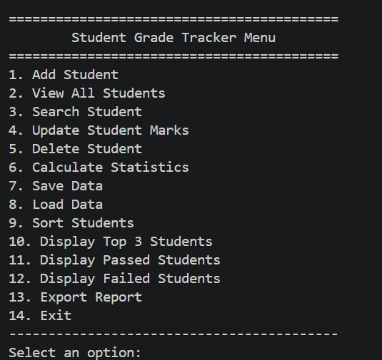
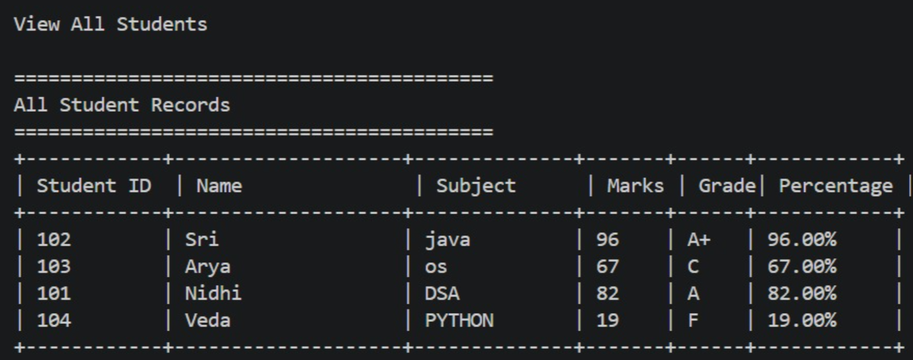
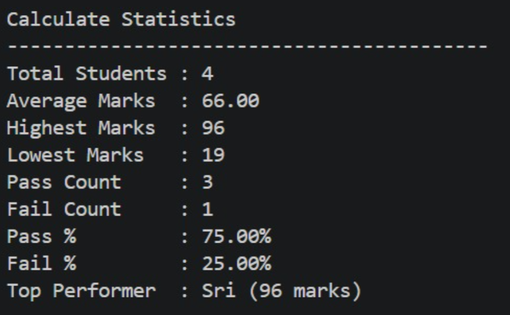

# 🎓 Student Grade Tracker

A Java Maven-based console application developed as part of the **CodeAlpha Java Programming Internship**.

##Project description🔎

Student Grade Tracker is a Java Maven console application that enables adding, updating, searching, deleting, sorting, and managing student records. It includes automatic grade calculation, performance statistics, top performer analysis, report export, and persistent file storage using Object-Oriented Programming principles.

## ✨ Features

- Add Student
- View All Students
- Search Student by id
- Update Student info
- Delete Student records
- Automatic Grade and Percentage
- Check statistics
  
    -Sort by Marks
  
    -Sort Alphabetically
  
    -Display Top 3 Students
  
    -Display Passed Students
  
    -Display Failed Students
  
- Export a formatted report to a text file
- Automatic data load from students.txt
- Save student data to students.txt
- Store Data Using File Handling
- Input validation  

## 🛠️ Technologies Used

- Java 17
- Maven
- Object-Oriented Programming (OOP)
- File Handling
- collection API(ArrayList)

## 📂 Project Structure

```
StudentGradeTracker/
├── pom.xml
├──.gitignore
├── README.md
└── src/main/java/com/codealpha/studenttracker
    ├── Main.java
    ├── model/Student.java
    ├── service/StudentService.java
    └── util
        ├── FileManager.java
        ├── InputValidator.java
        └── ReportGenerator.java
```


## 🚀 How to Run

1. Clone the repository.
```bash
git clone https://github.com/likhithasri9986/CodeAlpha-Student-Grade-Tracker.git
```
2. Build using Maven.
```bash
mvn clean package
```
3. Run `Main.java`.
4. Run the application:
   ```bash
   java -jar target/student-grade-tracker-1.0.0-jar-with-dependencies.jar

## 📸 Screenshots

### Main Menu



### Add Student


### View All Students



### Statistics




## 🔮 Future Enhancements

- Add Desktop GUI using JavaFX
- Add Database Integration (MySQL/PostgreSQL)
- Add user authentication and role-based permissions
- Add CSV import/export support
- Add reports for failing students and grade distributions

## 👩‍💻 Author

**B Likhitha Sri**

Computer Science Engineering Student
